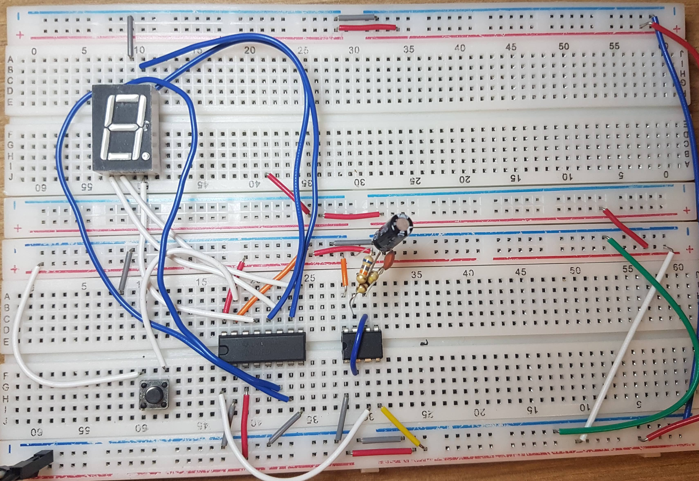

# Contador de Década

## Sobre

O contador de décadas foi um trabalho acadêmico de hardware, elaborado no 2° período do curso de graduação de Engenharia de Computação. Com o objetivo de aprender um pouco mais sobre circuitos integrados.

## Demonstração

## Componentes

- Botão (botão reset)
- Circuito Integrado CD4026
- Circuito Integrado NE555P
- Display de 7 segmentos
- Capacitor 10us
- Resistores 
- Placa protoborad e jumpers

## Créditos

Esse trabalho foi elaborado com muito carinho por

- Ana Beatriz Santos de Oliveira
- Beatriz Vaz Keppel
- [Mariana Aram](https://www.linkedin.com/in/mariana-aram-silva-a766b623b/)
- [Paula Talim](https://www.linkedin.com/in/paulatalim/)
- [Yago Garzon](https://www.linkedin.com/in/yago-garzon-chaves-7b57451b3/)
